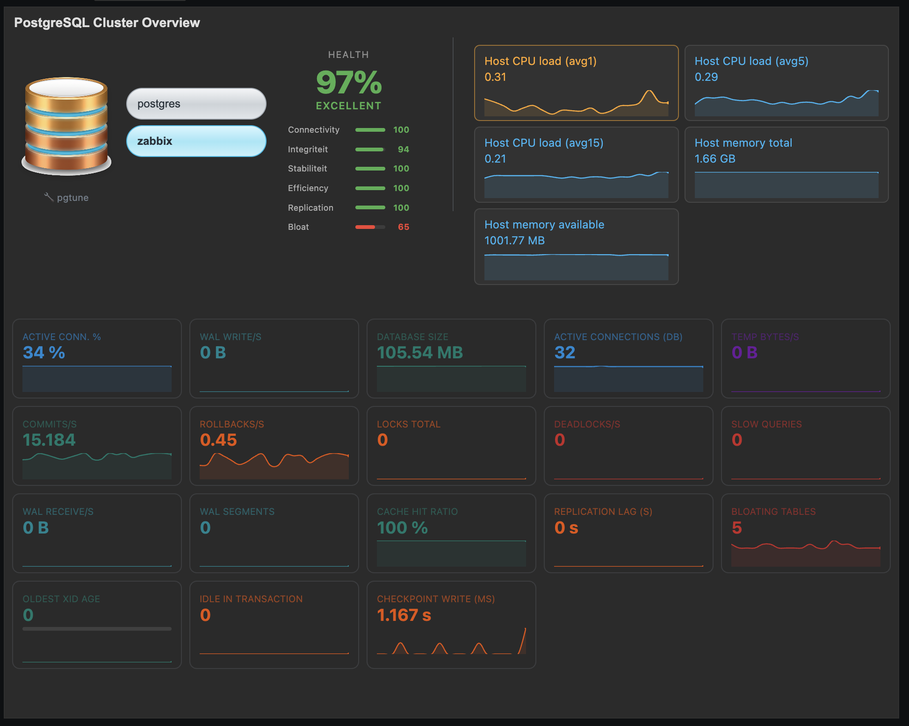

# PostgreSQL Cluster Overview widget (Zabbix 7)

Custom widget om databases in een PostgreSQL cluster selecteerbaar te tonen met kernmetrics uit het officiele template `PostgreSQL by Zabbix agent 2`.

## Wat deze widget doet

- Leest DB-lijst uit `pgsql.db.discovery[...]`.
- Toont een dropdown met gevonden databases.
- Toont per geselecteerde database:
  - Database size
  - Backends connected
  - Commits/s
  - Rollbacks/s
  - Locks total
  - Deadlocks/s
  - Slow queries (optioneel)

## Structuur

- `zabbix-widget-pgsql/manifest.json`
- `zabbix-widget-pgsql/Widget.php`
- `zabbix-widget-pgsql/actions/WidgetView.php`
- `zabbix-widget-pgsql/includes/WidgetForm.php`
- `zabbix-widget-pgsql/views/widget.view.php`
- `zabbix-widget-pgsql/views/widget.edit.php`
- `zabbix-widget-pgsql/assets/js/class.widget.js`
- `zabbix-widget-pgsql/assets/css/widget.css`
- `zabbix-widget-pgsql/assets/img/postgres-icon-24.svg`

## Installatie

1. Kopieer de map `zabbix-widget-pgsql` naar je Zabbix frontend modules map, meestal:
   - `/usr/share/zabbix/modules/`
2. Herstart webserver/php-fpm indien nodig.
3. In Zabbix: `Administration -> General -> Modules` en activeer `PostgreSQL Cluster Overview`.
4. Voeg widget toe op een dashboard.
5. Kies in widget-instellingen het `Database discovery item` (item key `pgsql.db.discovery[...]`).

## Notities

- De widget verwacht dat de host al gekoppeld is aan template `PostgreSQL by Zabbix agent 2`.
- Als discovery nog geen recente waarde heeft, valt de widget terug op item-keys die al bestaan op de host.
- Als je je eigen icoon wilt gebruiken, plaats `postgres-icon-24.png` in `assets/img/` en pas het pad aan in `actions/WidgetView.php`.
